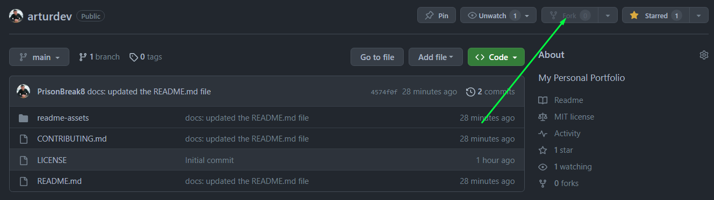
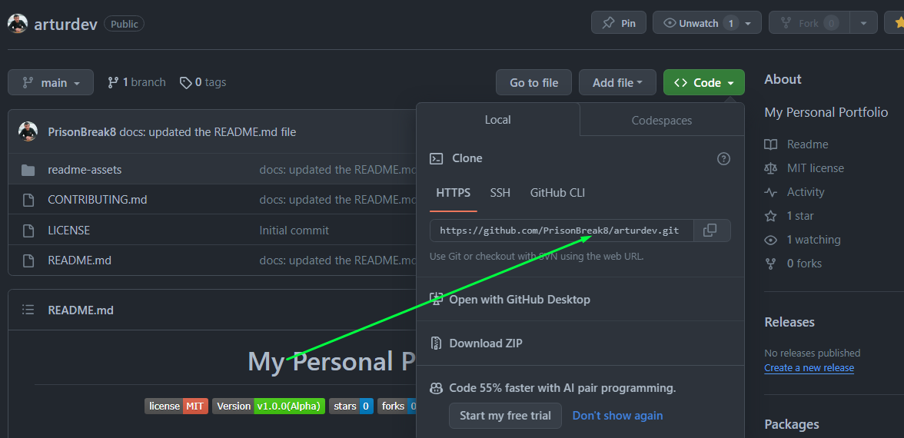

# Contribution Guidelines [](https://github.com/PrisonBreak8/arturdev/issues)

I want to make participation in this project as simple and transparent as possible, be it:

- I'm reporting a bug 🐛
- We are sending the correction 🔎
- I suggest new features 💡

This documentation contains a set of guidelines to help you during the contribution process. I are happy to welcome all the contributions from anyone willing to improve/add new scripts to this project.


## A. Preliminaries

- Download and install the latest stable version of [Git](https://git-scm.com/downloads)  for version control
- Create a [Github](https://github.com/join) Account 
- Download recommended for most Users version of [Node Js](https://nodejs.org/en/download)
- Download and install latest stable version of [VS Code](https://code.visualstudio.com/download)

## Setting up the Project
**1.**  Fork [this](https://github.com/PrisonBreak8/arturdev) repository.



**2.**  Clone your forked copy of the project. [this](https://github.com/PrisonBreak8/arturdev) repository.
```
git clone --depth 1 https://github.com/<your_user_name>/arturdev.git
```


**3.** Navigate to the project directory 📁.
```
cd arturdev
```
**4.** Add a reference to the original repository.
```
git remote add upstream https://github.com/PrisonBreak8/arturdev.git
```
**5.** Check the remotes for this repository.
```
git remote -v
```
**6.** Always take a pull from the upstream repository to your master branch to keep it at par with the my-portfolio project(updated repository).
```
git pull upstream main
```
- Comment on any existing [issue(s)](https://github.com/PrisonBreak8/arturdev/issues) raised by **project maintainers**. Otherwise raise a [new issue](https://github.com/PrisonBreak8/arturdev/issues/new).

> ### Guidelines for raising a new issue:
>
> - Each issue should have an appropriate and short title like "Bug in Experience Page"
> 
> - Be specific about your intended changes/suggestions
>
> - Attach a screenshot/clip if applicable
>
> - Feel free to suggest your opinions on the already raised issues.
>
> - I invite all members to suggest new features/bug fixes/improvements and raise new issues for them.
>

##  B. Contributing to the Project
**1.** Create a new branch (DO NOT name it MAIN or MASTER or anything random).
```
git checkout -b <your_branch_name>
```
**2.** Perfom your desired changes to the code base.

- Ensure that your changes apply to all screensizes

 - Comment any new code addition(s)

- Do not mess up the directory structure

- Preview your changes and test them properly before proceding ahead 

.gif

- Make a small clip or take screenshots before and after making changes.

**3.** Track your changes ✔️ 
```
git add . 
```

**4.** Commit your changes .
```
git commit -m "Relevant message"  (usually title of the pull request)
```
- **Make sure to condense your changes into a single commit**.

**5.** Push the committed changes in your feature branch to your remote repo.
```
git push -u origin <your_branch_name>
```

**6.** To create a pull request, click on `compare and pull requests`. Please ensure you compare your feature branch to the desired branch of the repo you are suppose to make a PR to.

<!---->

**7.** Then add an appropriate title and description to your pull request that explains your changes and efforts done.


**8.** Click on `Create Pull Request`.

<!---->

> ### Guidelines for raising a pull request:
>
> - Each pull request should have an appropriate and short title like "Fixed Bug in Experience Page"
>
> - Pull Requests without a description would often not be reviewed. Make sure you describe your intended changes in the description section of the pull request. (Use bullet points and phrases)
>
> - Make sure to refer the respective issue in the respective PR using phrases like `Resolves #issue_number` or `Closes #issue_number`.  Here's an example to raise a PR:
```
 Fixes #640

# Work Done:

- Fixed Responsiveness bug in the MOOC Section of the Education Page
- Made the Favicon more optimized
- ...
- ...
- ...

# Relevant Screenshots/Gifs
```

> - Attach a screenshot/clip of the change(s).
>
> - Look out for possible merge conflicts. Please add comments required, this makes your code readable.
>
>- Make sensible variable names. For example, card1 is quite ambiguous but education__card implies what that variable is declared for.


**9.** Voila ❗ You have made a PR to the my-portfolio project 💥 . 


