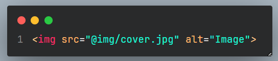

# Terminal Commands

**1.** Installation:
```
npm i
```
**2.** Launching developer mode (with server startup)
```
npm run dev
```
**3.** Starting the project build (without starting the server, only the final build)
```
npm run build
```
## Start creating an SVG sprite
*icons need to be placed in the src/svg icons folder,*
*the finished sprite will appear in the folder dist/img/icons/icons.svg*
*(does not work by default, if necessary, run with the command)*
```
npm run sprite
```
## Main files for working with the template:
📁 js/app.js

📁 scss/style.scss

📁 📁index.html - home page

📁 файлы html/*.htm - connectable parts

## Plugin for VS Code - Path Autocomplete
*Settings. Press F1 in the editor, find the Settings JSON settings, add code:*
```
"path-autocomplete.pathMappings": {
	"@img": "${folder}/src/img", // псевдоним для папки img
	"@scss": "${folder}/src/scss", // псевдоним для папки scss
	"@js": "${folder}/src/js", //  псевдоним для папки js
}
```
*After this, you can safely use pseudonyms when*
*connecting files, for example:*



## Template architecture. Files and folders

**1.** The **package.json** file is a file containing launch commands
builders, information about installed plugins and their versions

**2.** The **gulple.js** file is the main file of the GULP builder.

**3.** **config folder** - contains folders and files for setting up work
collectors, as well as files with individual tasks.

**4.** The **src** folder contains the project's source files and folders.
